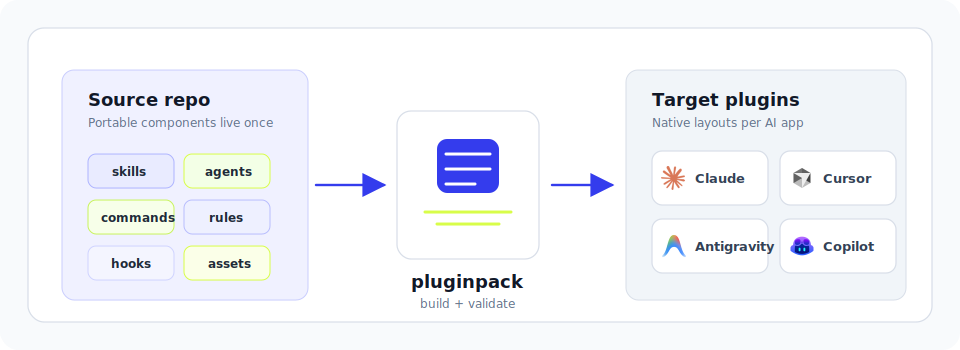

# pluginpack

[![Experimental](https://img.shields.io/badge/-Experimental-D8FD49?style=flat-square&logo=data:image/svg+xml;base64,PHN2ZyB2aWV3Qm94PSIwIDAgMzIgMzIiIGZpbGw9Im5vbmUiIHhtbG5zPSJodHRwOi8vd3d3LnczLm9yZy8yMDAwL3N2ZyI+CjxwYXRoIGQ9Ik0yNC4zMDA2IDIuOTU0MjdMMjAuNzY1NiAwLjE5OTk1MUwxNy45MDI4IDMuOTk1MjdDMTMuNTY1MyAxLjkzNDk1IDguMjMwMTkgMy4wODQzOSA1LjE5Mzk0IDcuMDA5ODNDMS42NTg4OCAxMS41NjQyIDIuNDgzIDE4LjExMzggNy4wMzczOCAyMS42NDg5QzguNzcyMzggMjIuOTkzNSAxMC43ODkzIDIzLjcwOTIgMTIuODI3OSAyMy44MTc3QzE2LjE0NjEgMjQuMDEyOCAxOS41MDc3IDIyLjYyNDggMjEuNjc2NSAxOS44MDU1QzI0LjczNDQgMTUuODggMjQuNTE3NSAxMC40MTQ4IDIxLjQ1OTYgNi43Mjc4OUwyNC4zMDA2IDIuOTU0MjdaTTE4LjExOTcgMTcuMDUxMkMxNi4xMDI4IDE5LjYzMiAxMi4zNzI1IDIwLjEwOTEgOS43NzAwMSAxOC4wOTIyQzcuMTg5MTkgMTYuMDc1MiA2LjcxMjA3IDEyLjMyMzMgOC43MjkwMSA5Ljc0MjQ2QzkuNzA0OTQgOC40ODQ1OCAxMS4xMTQ2IDcuNjgyMTQgMTIuNjc2MSA3LjQ4Njk2QzEzLjA0NDggNy40NDM1OCAxMy40MTM1IDcuNDIxOSAxMy43ODIyIDcuNDQzNThDMTQuOTc1IDcuNTA4NjUgMTYuMTI0NCA3Ljk0MjM5IDE3LjA3ODcgOC42Nzk3N0MxOS42NTk1IDEwLjcxODQgMjAuMTM2NiAxNC40NzAzIDE4LjExOTcgMTcuMDUxMloiIGZpbGw9IndoaXRlIi8+CjxwYXRoIGQ9Ik0yNC41MTc2IDIxLjY5MjJDMjMuOTMyIDIyLjQ1MTMgMjMuMjgxNCAyMy4xMjM2IDIyLjU2NTcgMjMuNzUyNUMyMS44NzE3IDI0LjMzODEgMjEuMTEyNyAyNC44ODAzIDIwLjMxMDIgMjUuMzM1N0MxOS41Mjk1IDI1Ljc2OTUgMTguNjgzNyAyNi4xMzgyIDE3LjgzNzggMjYuNDIwMUMxNi45OTIgMjYuNzAyIDE2LjEwMjggMjYuODk3MiAxNS4yMTM3IDI3LjAwNTdDMTQuMzI0NSAyNy4xMTQxIDEzLjQzNTMgMjcuMTU3NSAxMi41MjQ0IDI3LjA5MjRDMTEuNjEzNSAyNy4wMjczIDEwLjcyNDMgMjYuODc1NSA5Ljg1Njg0IDI2LjY1ODdMOS42NjE2NSAyNy4zNzQzTDguNzcyNDYgMzAuOTk2MkM5LjkwMDIxIDMxLjI5OTggMTEuMDQ5NyAzMS40NzMzIDEyLjIyMDggMzEuNTZDMTIuMjY0MiAzMS41NiAxMi4zMjkyIDMxLjU2IDEyLjM3MjYgMzEuNTZDMTMuNTAwMyAzMS42MjUxIDE0LjY0OTggMzEuNTgxNyAxNS43NTU4IDMxLjQ1MTZDMTYuOTI3IDMxLjI5OTggMTguMDk4MSAzMS4wMzk1IDE5LjIyNTggMzAuNjcwOEMyMC4zNTM2IDMwLjMwMjIgMjEuNDU5NyAyOS44MjUgMjIuNTAwNyAyOS4yMzk1QzIzLjU2MzQgMjguNjUzOSAyNC41NjEgMjcuOTM4MiAyNS40OTM1IDI3LjE1NzVDMjYuNDQ3OCAyNi4zNTUgMjcuMzE1MyAyNS40NDQyIDI4LjA3NDQgMjQuNDQ2NUMyOC4xODI4IDI0LjMxNjQgMjguMjY5NSAyNC4xNjQ2IDI4LjM3OCAyNC4wMTI4TDI0Ljc3NzkgMjEuMzQ1MkMyNC42Njk0IDIxLjQ1MzcgMjQuNjA0NCAyMS41ODM4IDI0LjUxNzYgMjEuNjkyMloiIGZpbGw9IndoaXRlIi8+Cjwvc3ZnPg==&labelColor=343CED)](https://github.com/gleanwork/.github/blob/main/docs/repository-stability.md#experimental)
[](https://www.npmjs.com/package/@gleanwork/pluginpack)
[](https://github.com/gleanwork/pluginpack/actions/workflows/ci.yml)
[](https://opensource.org/licenses/MIT)

One source of truth for agent plugins across AI app ecosystems.

`pluginpack` is a build tool for compiling portable skills, commands, agents, rules, hooks, assets, and metadata into the native plugin layouts expected by each AI app. It copies files, writes target manifests, and validates generated output; it is not a package manager or publisher.

<p align="center">
  
</p>

## Quick Start

Start with portable plugin components, declare the native targets you want, then run `pluginpack build`.

```bash snippet=readme/snippet-01.bash
npm install -D @gleanwork/pluginpack
```

Create repo-level component directories:

```tree
skills/
  release-notes/
    SKILL.md
agents/
  search-assistant.md
commands/
  summarize.md
rules/
  style.mdc
hooks/
  before-run.sh
assets/
  icon.png
pluginpack.config.ts
```

Add a config that maps that portable source into native plugin outputs. `source.skills` gives the repo a simple portable install surface; sibling component directories are included when the selected target supports them or when you opt into them with `components`.

```ts snippet=readme/snippet-02.ts
import { defineConfig } from "@gleanwork/pluginpack";

export default defineConfig({
  name: "acme-plugins",
  version: "0.1.0",
  source: {
    skills: "skills",
    rootPlugin: {
      id: "core",
      description: "Acme portable skills.",
    },
  },
  metadata: {
    description: "Acme agent plugins.",
    author: { name: "Acme" },
    license: "MIT",
  },
  targets: {
    cursor: {
      outDir: ".",
      plugins: {
        acme: {
          from: ["core"],
          path: "plugins/cursor/acme",
        },
      },
    },
    claude: {
      outDir: ".",
      pluginRoot: "plugins/claude",
      plugins: {
        acme: { from: ["core"] },
      },
    },
    antigravity: {
      outDir: "plugins/antigravity",
      plugins: {
        acme: { from: ["core"] },
      },
    },
    copilot: {
      outDir: "plugins/copilot",
      plugins: {
        acme: { from: ["core"] },
      },
    },
  },
});
```

Build and validate the generated outputs:

```bash
npx pluginpack build
npx pluginpack validate --target cursor
```

Users who only want portable skills install from the `skills/` subpath, for example `npx skills add owner/repo/skills --skill '*'`. Claude, Cursor, Antigravity, and Copilot users install from the generated native layout that can include skills, agents, rules, hooks, assets, MCP config, and target-specific manifests.

## Mental Model

Agent apps increasingly support similar ideas: skills, commands, agents, rules, hooks, MCP configuration, and plugin marketplaces. The packaging formats are different enough that maintaining one repo per app quickly drifts.

`pluginpack` does four things:

- reads a portable source plugin from your repo
- copies selected component directories into each target
- writes the manifests each target expects
- validates, diffs, prunes, and cleans generated output

It does not try to make every app behave the same. Target adapters own target-specific layout, manifests, and validation.

## Recommended Shape

The preferred path is one public plugin repository with top-level component directories. `skills/` remains the portable `skills` CLI install surface, while the other component directories feed native plugin outputs.

```tree
skills/
  release-notes/
    SKILL.md
agents/
  search-assistant.md
commands/
  summarize.md
rules/
  style.mdc
hooks/
  before-run.sh
assets/
  icon.png
pluginpack.config.ts

.cursor-plugin/
  marketplace.json
plugins/
  cursor/
    acme/
      .cursor-plugin/plugin.json
      agents/
      rules/
      hooks/
      skills/
  claude/
    acme/
      .claude-plugin/plugin.json
      agents/
      hooks/
      skills/
  antigravity/
    .pluginpack/
      antigravity.json
    acme/
      mcp_config.json
      plugin.json
      agents/
      rules/
      hooks/
      skills/
  copilot/
    .claude-plugin/
      marketplace.json
    .github/
      plugin/
        marketplace.json
    .pluginpack/
      copilot.json
    plugins/
      acme/
        agents/
        hooks/
        skills/
.claude-plugin/
  marketplace.json
.pluginpack/
  cursor.json
  claude.json
```

`source.skills` points at the repo-level skills directory and creates a root source plugin from the sibling component directories. `source.rootPlugin.id` creates the source plugin name used by each target's `from` array. The repo root is intentionally also home to generated native plugin outputs, so the `skills/` subpath keeps `skills` CLI discovery focused on the canonical portable skills.

`pluginpack` writes a `.pluginpack/<target>.json` managed-file manifest for each built target. That manifest lets builds and cleanup commands remove stale generated files without touching source files or unmanaged repo content.

## Components

In `pluginpack`, a component is a top-level plugin capability directory. Components are the portable pieces of a source plugin that may or may not exist in every target ecosystem.

Supported component directories are:

```txt
skills/
agents/
commands/
rules/
hooks/
scripts/
assets/
policies/
themes/
```

Target adapters translate those component directories into each app's native layout and manifest fields. Each target has a smart default component list. By default, `claude`, `cursor`, `antigravity`, and `copilot` emit skills and other native plugin support files but omit `commands`, since those ecosystems increasingly expose skills as slash commands.

Use `components` only when a plugin needs an exact target-specific component set:

```ts snippet=readme/snippet-03.ts
import { defineConfig } from "@gleanwork/pluginpack";

export default defineConfig({
  name: "acme-plugins",
  version: "0.1.0",
  source: {
    skills: "skills",
    rootPlugin: {
      id: "core",
      description: "Acme portable skills.",
    },
  },
  metadata: {
    description: "Acme agent plugins.",
    author: { name: "Acme" },
    license: "MIT",
  },
  targets: {
    antigravity: {
      outDir: "plugins/antigravity",
      plugins: {
        acme: { from: ["core"], components: ["skills", "commands"] },
      },
    },
    claude: {
      outDir: "plugins/claude",
      plugins: {
        acme: { from: ["core"], components: ["skills"] },
      },
    },
  },
});
```

## Targets

The first adapters are:

- `cursor`
- `claude`
- `antigravity`
- `copilot`
- `codex`

`cursor` emits Cursor plugin and marketplace manifests. `claude` emits Claude plugin and marketplace manifests. `antigravity` emits Antigravity CLI plugins with a `plugin.json` manifest and optional `mcp_config.json`. `copilot` emits the GitHub Copilot plugins format (per [`github/copilot-plugins`](https://github.com/github/copilot-plugins)): a `.claude-plugin/marketplace.json` mirrored to `.github/plugin/marketplace.json`, each plugin under `plugins/<name>/` with a `skills` array per marketplace entry. `codex` emits the [OpenAI Codex CLI plugin format](https://developers.openai.com/codex/plugins/build): a repo-scoped `.agents/plugins/marketplace.json` plus a per-plugin `.codex-plugin/plugin.json` manifest and optional `.mcp.json`.

Because Copilot reuses the Claude marketplace layout, the `claude` and `copilot` targets both write `.claude-plugin/marketplace.json` and therefore need separate output roots (distinct `outDir`s or separate repos).

More targets should be added from official docs or real plugin examples, not guessed abstractions.

## Source Plugins

The quick-start shape treats repo-level component directories as one source plugin. For more complex source content, keep source plugins under `plugins/` and emit them into one or more target outputs:

```tree
plugins/
  core/
    plugin.pluginpack.json
    .mcp.json
    skills/
      release-notes/
        SKILL.md
    agents/
    commands/
    rules/
    hooks/
    assets/
```

A target can emit a source plugin directly, rename it, or merge multiple source plugins into one emitted plugin.

## MCP Servers

A source plugin declares MCP servers with a standard `.mcp.json` file at its root (`{ "mcpServers": { "name": { ... } } }`), or with an `mcpServers` key in `plugin.pluginpack.json`. The file wins if both are present, and merging plugins with the same server name is an error.

Each target wires MCP into its native shape: `claude` ships `.mcp.json` at the plugin root (auto-discovered), `cursor` references it from `plugin.json` (`"mcpServers": "./.mcp.json"`), `copilot` references it from the marketplace entry, and `antigravity` writes `mcp_config.json` beside `plugin.json`.

## Target Overrides

Skill files are not always perfectly portable. When one app needs different frontmatter or content, add a target override next to the base file:

```txt
skills/release-notes/SKILL.md
skills/release-notes/targets/cursor/SKILL.md
skills/release-notes/targets/claude/SKILL.md
```

Resolution order is target override first, then the base file.

## Other Shapes

There are two reasonable alternatives when the single-repo shape is not enough:

- Single source repo, multiple output repos: best when each target ecosystem expects its own repo root shape.
- Single source repo, release artifacts: best when users install zipped plugin payloads or release assets instead of browsing generated files in Git.

## Why Not Just Copy Files?

For one target, copying files by hand may be enough. `pluginpack` starts to earn its keep when you need deterministic manifests, target-specific overrides, validation, and CI checks across multiple target repos.

## CI Change Detection

`pluginpack diff` is designed for automation. It builds into a temporary directory, compares generated managed files against an existing plugin repo, and exits non-zero when the plugin repo is stale:

```bash snippet=readme/snippet-04.bash
pluginpack diff --target cursor --against ../cursor-plugins
pluginpack diff --target claude --against ../claude-plugins
```

Use that in CI to fail clearly or to trigger an action that opens a PR against the generated plugin repo.

When a generated target repo intentionally owns a path, add `ignoredDiffPaths` to that target config. Entries are target-output-relative paths; a directory entry ignores everything below it.

To publish a repo-root file (for example a README authored once in the source repo) into a target's output, add `rootFiles` to that target config — a map of output path to source path (relative to the config root). Emitted root files are managed like any other generated file, so an output repo's README stays synced from source instead of hand-maintained per repo.

## Configuration Reference

`pluginpack.config.ts` exports a config object (wrap it in `defineConfig` for types). `src/schema.ts` is the source of truth; this table enumerates every field. Paths marked _safe relative_ reject absolute paths and `..` escapes.

**Top level**

| Field      | Type   | Required | Meaning                                                                    |
| ---------- | ------ | -------- | -------------------------------------------------------------------------- |
| `name`     | string | yes      | Marketplace/source name written into generated manifests.                  |
| `version`  | string | yes      | Default version stamped into manifests (per-target/plugin overridable).    |
| `source`   | object | no       | Where source plugins come from (see **`source`**).                         |
| `metadata` | object | no       | Shared metadata merged into manifests (see **`metadata`**).                |
| `targets`  | object | yes      | Per-target output config, keyed by target name (see **`targets.<name>`**). |

**`source`**

| Field        | Type   | Required | Meaning                                                                                                                                                                      |
| ------------ | ------ | -------- | ---------------------------------------------------------------------------------------------------------------------------------------------------------------------------- |
| `plugins`    | string | no       | Directory to discover source plugins from. Defaults to `plugins`.                                                                                                            |
| `skills`     | string | no       | Repo-level skills directory; creates a root source plugin from sibling component dirs.                                                                                       |
| `rootPlugin` | object | no       | Metadata for that root skills plugin. Accepts all **`metadata`** fields plus `id`, `name`, `description`. `id` is the source-plugin name used in each target's `from` array. |

**`metadata`** (and `source.rootPlugin`)

| Field         | Type                     | Meaning                              |
| ------------- | ------------------------ | ------------------------------------ |
| `displayName` | string                   | Human-readable name.                 |
| `description` | string                   | Short description.                   |
| `author`      | `{ name, email?, url? }` | Author identity (`name` required).   |
| `owner`       | `{ name, email?, url? }` | Marketplace owner (`name` required). |
| `homepage`    | string                   | Homepage URL.                        |
| `repository`  | string                   | Repository URL.                      |
| `license`     | string                   | SPDX license id.                     |
| `logo`        | string                   | Logo path or URL.                    |
| `keywords`    | string[]                 | Marketplace keywords.                |
| `category`    | string                   | Marketplace category.                |
| `tags`        | string[]                 | Free-form tags.                      |

**`targets.<name>`** — `<name>` is one of `cursor`, `claude`, `antigravity`, `copilot`, `codex`.

| Field              | Type                   | Required | Meaning                                                                                  |
| ------------------ | ---------------------- | -------- | ---------------------------------------------------------------------------------------- |
| `outDir`           | string                 | yes      | Output directory for this target, relative to the config root.                           |
| `plugins`          | record                 | yes      | Emitted plugins, keyed by emitted plugin name (see **`targets.<name>.plugins.<name>`**). |
| `marketplaceDir`   | string (safe relative) | no       | Override the marketplace dir (defaults: `.cursor-plugin` / `.claude-plugin`).            |
| `pluginRoot`       | string (safe relative) | no       | Override the plugin root dir (`claude`; defaults to `plugins`).                          |
| `version`          | string                 | no       | Override the version for this target (defaults to top-level `version`).                  |
| `manifest`         | object                 | no       | Deep-merged into the generated marketplace manifest.                                     |
| `ignoredDiffPaths` | string[]               | no       | Output-relative paths `diff` ignores (a dir entry ignores everything below it).          |
| `rootFiles`        | record (safe relative) | no       | Map of output path → source path emitted verbatim at the output root.                    |

**`targets.<name>.plugins.<name>`**

| Field         | Type                   | Required | Meaning                                                                                                                                                                                          |
| ------------- | ---------------------- | -------- | ------------------------------------------------------------------------------------------------------------------------------------------------------------------------------------------------ |
| `from`        | string[] (min 1)       | yes      | Source plugin ids to merge into this emitted plugin.                                                                                                                                             |
| `path`        | string (safe relative) | no       | Output path for the plugin, relative to `outDir`. Defaults to the plugin name (or `pluginRoot/<name>` for `claude`).                                                                             |
| `version`     | string                 | no       | Per-plugin version override.                                                                                                                                                                     |
| `displayName` | string                 | no       | Per-plugin display name.                                                                                                                                                                         |
| `description` | string                 | no       | Per-plugin description override.                                                                                                                                                                 |
| `manifest`    | object                 | no       | Deep-merged into the generated plugin manifest.                                                                                                                                                  |
| `entry`       | object                 | no       | Deep-merged into the generated marketplace entry (the object in the marketplace `plugins` array). Use for target-specific entry fields pluginpack can't derive — e.g. Codex `policy`/`category`. |
| `components`  | string[]               | no       | Exact component set, overriding the target's smart default.                                                                                                                                      |

## Programmatic API

Everything the CLI does is exported from the package entry, so you can script builds (the [`pluginpack-action`](https://github.com/gleanwork/pluginpack-action) consumes these directly):

```ts
import {
  defineConfig,
  loadConfig,
  build,
  diffTarget,
  validateOutput,
  prune,
  clean,
} from "@gleanwork/pluginpack";
```

| Function                        | Returns                     | Purpose                                                          |
| ------------------------------- | --------------------------- | ---------------------------------------------------------------- |
| `defineConfig(config)`          | `PluginpackConfig`          | Identity helper that types `pluginpack.config.ts`.               |
| `loadConfig(cwd?, configPath?)` | `Promise<ResolvedProject>`  | Resolve config and discover source plugins.                      |
| `build(options?)`               | `Promise<Artifact[]>`       | Emit configured targets; writes to disk unless `options.dryRun`. |
| `diffTarget(options)`           | `Promise<DiffResult>`       | Build into a temp dir and compare against an existing repo.      |
| `validateOutput(target, dir)`   | `Promise<ValidationResult>` | Validate an existing target output directory.                    |
| `prune(options?)`               | `Promise<CleanupResult[]>`  | Remove stale managed files no longer emitted by the config.      |
| `clean(options?)`               | `Promise<CleanupResult[]>`  | Remove all managed files for configured targets.                 |

Option objects:

- `build` — `{ cwd?, configPath?, target?, outDir?, dryRun? }`
- `diffTarget` — `{ cwd?, configPath?, target, against }`
- `prune` / `clean` — `{ cwd?, configPath?, target?, dryRun?, force? }`

The result and config types (`Artifact`, `DiffResult`/`DiffEntry`, `ValidationResult`/`ValidationIssue`, `CleanupResult`/`CleanupEntry`, `ResolvedProject`, `PluginpackConfig`, `TargetConfig`, `TargetName`, …) are all exported for use in TypeScript.

<!-- pluginpack-cli:start -->

## CLI Reference

### `init`

Create a starter pluginpack.config.ts and source plugin layout.

```bash
pluginpack init [options]
```

Examples:

- `pluginpack init`

Exit codes:

- 0 when files are created
- 1 when files already exist or cannot be written

### `build`

Compile configured source plugins into target-native plugin payloads.

```bash
pluginpack build [--target cursor|claude|antigravity|copilot|codex] [--out-dir <path>] [--dry-run]
```

Options:

- `--target <target>`: Build only one configured target.
- `--out-dir <path>`: Override the configured output directory for the selected target.
- `--dry-run`: Resolve and print planned managed output paths without writing files.

Examples:

- `pluginpack build`
- `pluginpack build --target cursor`
- `pluginpack build --target claude --dry-run`

Exit codes:

- 0 when all selected targets build
- 1 when config, source resolution, or file output fails

### `validate`

Validate an existing target output directory for native manifest, path, and frontmatter requirements.

```bash
pluginpack validate --target cursor|claude|antigravity|copilot|codex [--dir <path>]
```

Options:

- `--target <target>`: Required target validator.
- `--dir <path>`: Directory to validate. Defaults to the configured target outDir.

Examples:

- `pluginpack validate --target cursor --dir ../cursor-plugins`

Exit codes:

- 0 when validation passes
- 1 when validation finds errors

### `diff`

Build into a temporary directory and compare generated managed files with an existing target repo.

```bash
pluginpack diff --target cursor|claude|antigravity|copilot|codex --against <path>
```

Options:

- `--target <target>`: Required target to build and compare.
- `--against <path>`: Existing target repo or output directory to compare against.

Examples:

- `pluginpack diff --target cursor --against ../cursor-plugins`

Exit codes:

- 0 when managed files match
- 1 when managed files differ or the command fails

### `prune`

Remove stale managed files that are no longer emitted by the current config.

```bash
pluginpack prune [--target cursor|claude|antigravity|copilot|codex] [--dry-run]
```

Options:

- `--target <target>`: Prune only one configured target.
- `--dry-run`: Print stale managed files without deleting them.
- `--force`: Delete even paths that resolve inside the source tree or config.

Examples:

- `pluginpack prune`
- `pluginpack prune --target claude --dry-run`

Exit codes:

- 0 when stale managed files are removed or listed
- 1 when config, source resolution, or cleanup fails

### `clean`

Remove all managed files for configured target outputs.

```bash
pluginpack clean [--target cursor|claude|antigravity|copilot|codex] [--dry-run]
```

Options:

- `--target <target>`: Clean only one configured target.
- `--dry-run`: Print managed files without deleting them.
- `--force`: Delete even paths that resolve inside the source tree or config.

Examples:

- `pluginpack clean`
- `pluginpack clean --target cursor --dry-run`

Exit codes:

- 0 when managed files are removed or listed
- 1 when config, manifest loading, or cleanup fails

### `docs`

Generate the README CLI reference section from command metadata.

```bash
pluginpack docs [options]
```

Options:

- `--check`: Fail if README.md is not up to date.

Examples:

- `pluginpack docs`
- `pluginpack docs --check`

Exit codes:

- 0 when docs are current or updated
- 1 when --check finds stale docs
<!-- pluginpack-cli:end -->
