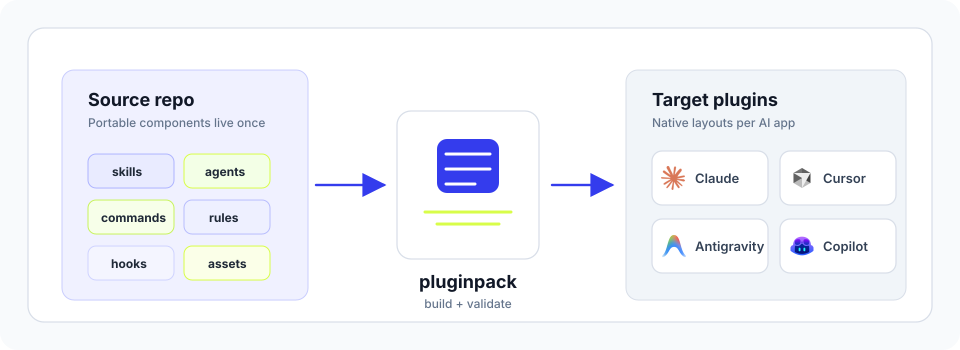

# pluginpack

[![Prerelease](https://img.shields.io/badge/-Prerelease-F6F3EB?style=flat-square&logo=&labelColor=343CED)](https://github.com/gleanwork/.github/blob/main/docs/repository-stability.md#prerelease)
[](https://www.npmjs.com/package/@gleanwork/pluginpack)
[](https://github.com/gleanwork/pluginpack/actions/workflows/ci.yml)
[](https://opensource.org/licenses/MIT)

One source of truth for agent plugins across AI app ecosystems.

`pluginpack` is a build tool for compiling portable skills, commands, agents, rules, hooks, assets, and metadata into the native plugin layouts expected by each AI app. It copies files, writes target manifests, and validates generated output; it is not a package manager or publisher.

<p align="center">
  
</p>

## Quick Start

Start with portable plugin components, declare the native targets you want, then run `pluginpack build`.

```bash snippet=readme/snippet-01.bash
npm install -D @gleanwork/pluginpack
```

Create one shared source directory per plugin:

```tree
shared/
  acme/
    skills/
      release-notes/
        SKILL.md
    agents/
      search-assistant.md
    assets/
      icon.png
pluginpack.config.ts
```

Map that shared source directly into each native plugin output. Add an `overlay`
only when a target needs files that differ from or do not exist in the shared
source.

```ts snippet=readme/snippet-02.ts
import { defineConfig } from "@gleanwork/pluginpack";

export default defineConfig({
  name: "acme-plugins",
  version: "0.1.0",
  metadata: {
    description: "Acme agent plugins.",
    author: { name: "Acme" },
    license: "MIT",
  },
  targets: {
    cursor: {
      outDir: ".",
      plugins: {
        acme: {
          source: "shared/acme",
          overlay: "overrides/cursor/acme",
          path: "plugins/cursor/acme",
        },
      },
    },
    claude: {
      outDir: ".",
      pluginRoot: "plugins/claude",
      plugins: {
        acme: { source: "shared/acme" },
      },
    },
    antigravity: {
      outDir: "plugins/antigravity",
      plugins: {
        acme: { source: "shared/acme" },
      },
    },
    copilot: {
      outDir: "plugins/copilot",
      plugins: {
        acme: { source: "shared/acme" },
      },
    },
    codex: {
      outDir: "plugins/codex",
      plugins: {
        acme: { source: "shared/acme" },
      },
    },
  },
});
```

Build and validate the generated outputs:

```bash
npx pluginpack build
npx pluginpack validate --target cursor
```

Claude, Cursor, Antigravity, Copilot, and Codex users install from the generated
native layout. Repositories that also expose a `skills` CLI surface may point
that tool at `shared/<plugin>/skills`.

## Mental Model

Agent apps increasingly support similar ideas: skills, commands, agents, rules, hooks, MCP configuration, and plugin marketplaces. The packaging formats are different enough that maintaining one repo per app quickly drifts.

`pluginpack` does four things:

- reads a portable source plugin from your repo
- copies selected component directories into each target
- writes the manifests each target expects
- validates, diffs, prunes, and cleans generated output

It does not try to make every app behave the same. Target adapters own target-specific layout, manifests, and validation.

## Recommended Shape

The preferred authored shape separates shared plugin content, target overlays,
and generated-repository files:

```tree
shared/
  acme/
    skills/
    agents/
    assets/
    mcp/
      config.json
      pluginpack.json
overrides/
  cursor/
    acme/
      rules/
repositories/
  cursor/
    README.md
pluginpack.config.ts

.cursor-plugin/
  marketplace.json
plugins/
  cursor/
    acme/
      .cursor-plugin/plugin.json
      agents/
      rules/
      hooks/
      skills/
  claude/
    acme/
      .claude-plugin/plugin.json
      agents/
      hooks/
      skills/
  antigravity/
    .pluginpack/
      antigravity.json
    acme/
      mcp_config.json
      plugin.json
      agents/
      rules/
      hooks/
      skills/
  copilot/
    .claude-plugin/
      marketplace.json
    .github/
      plugin/
        marketplace.json
    .pluginpack/
      copilot.json
    plugins/
      acme/
        agents/
        hooks/
        skills/
.claude-plugin/
  marketplace.json
.pluginpack/
  cursor.json
  claude.json
```

Each emitted plugin names one `source`. An optional `overlay` is applied after
the source, so it can add or replace files for that target. `repositoryFiles`
copies a whole directory into the generated repository root.

`pluginpack` writes a `.pluginpack/<target>.json` managed-file manifest for each built target. That manifest lets builds and cleanup commands remove stale generated files without touching source files or unmanaged repo content.

## Components

In `pluginpack`, a component is a top-level plugin capability directory. Components are the portable pieces of a source plugin that may or may not exist in every target ecosystem.

Supported component directories are:

```txt
skills/
agents/
commands/
rules/
hooks/
scripts/
assets/
policies/
themes/
```

Target adapters translate those component directories into each app's native layout and manifest fields. Each target has a smart default component list. By default, `claude`, `cursor`, `antigravity`, and `copilot` emit skills and other native plugin support files but omit `commands`, since those ecosystems increasingly expose skills as slash commands.

Use `include` or `exclude` only when a target needs a different content set:

```ts snippet=readme/snippet-03.ts
import { defineConfig } from "@gleanwork/pluginpack";

export default defineConfig({
  name: "acme-plugins",
  version: "0.1.0",
  metadata: {
    description: "Acme agent plugins.",
    author: { name: "Acme" },
    license: "MIT",
  },
  targets: {
    antigravity: {
      outDir: "plugins/antigravity",
      plugins: {
        acme: {
          source: "shared/acme",
          include: ["skills", "commands", "static"],
        },
      },
    },
    claude: {
      outDir: "plugins/claude",
      plugins: {
        acme: { source: "shared/acme", exclude: ["commands"] },
      },
    },
  },
});
```

## Targets

Each target compiles the same source into one app's native plugin layout:

| Target        | Native format                                                                 | Output it writes                                                                                                 |
| ------------- | ----------------------------------------------------------------------------- | ---------------------------------------------------------------------------------------------------------------- |
| `cursor`      | Cursor plugin + marketplace                                                   | `.cursor-plugin/marketplace.json`; a `.cursor-plugin/plugin.json` per plugin                                     |
| `claude`      | Claude plugin + marketplace                                                   | `.claude-plugin/marketplace.json`; a `.claude-plugin/plugin.json` per plugin                                     |
| `antigravity` | Antigravity CLI plugin                                                        | a `plugin.json` per plugin + optional `mcp_config.json` (no marketplace)                                         |
| `copilot`     | [GitHub Copilot plugins](https://github.com/github/copilot-plugins)           | `.claude-plugin/marketplace.json` mirrored to `.github/plugin/marketplace.json`; plugins under `plugins/<name>/` |
| `codex`       | [OpenAI Codex CLI plugins](https://developers.openai.com/codex/plugins/build) | `.agents/plugins/marketplace.json`; a `.codex-plugin/plugin.json` per plugin + optional `.mcp.json`              |

> **Heads up:** `claude` and `copilot` both write `.claude-plugin/marketplace.json`, so they need distinct `outDir`s (or separate repos). `build` errors on overlapping output paths.

New targets are added from official docs or real plugin examples — not guessed abstractions.

## Legacy 0.10 Source Composition

Pluginpack 0.11 can still read `source.plugins`, `source.skills`, `rootPlugin`,
`from`, nested `targets/<host>` replacements, and root `.mcp.json` files for one
migration window. New repositories should not use that interface. Follow
[`MIGRATING_TO_0.11.md`](./MIGRATING_TO_0.11.md) to convert an existing repo.

## Update Check (claude, cursor)

Hosts don't reliably tell users a plugin is outdated (Claude Code's auto-update is off by default for third-party marketplaces; Cursor has no nudge at all). Opt in per target with `updateCheck` and pluginpack generates a session-start hook into each emitted plugin:

```ts
targets: {
  claude: { outDir: "...", updateCheck: {}, plugins: { ... } },
  cursor: { outDir: "...", updateCheck: {}, plugins: { ... } },
}
```

Each emitted plugin gains `scripts/pluginpack-update-check.sh` plus a `hooks/hooks.json` registration (merged into a source-authored `hooks/hooks.json` when one exists). At session start the script compares the version stamped at build time against the latest stable semver git tag of the plugin repo and, when behind, nudges: on `claude` via a user-visible `systemMessage` (with the `/plugin update` command to run); on `cursor` via agent context (Cursor's `sessionStart` hook has no user-visible output).

The check follows update-notifier discipline:

- The repo URL comes from `updateCheck.repository`, defaulting to `metadata.repository` (an error if neither is set).
- At most one `git ls-remote` per repo per 24h, cached under `${XDG_CACHE_HOME:-~/.cache}/pluginpack/` and shared across plugins from the same repo.
- Fail-open: offline, missing `git`, odd tags, or any other problem exits silently.
- Skipped entirely when `CI` is set or `PLUGINPACK_NO_UPDATE_CHECK=1`.

Disable for a single plugin with `updateCheck: false` on that plugin. Configuring `updateCheck` on `copilot`, `antigravity`, or `codex` is a config error — those hosts don't run plugin hooks.

Like MCP config, the generated hook is wired in regardless of a plugin's content selection: on `cursor`, the manifest's `hooks` field is set even if `include` does not name `"hooks"`, since the check itself is a separate opt-in.

## Install Snippet

Once a target's output is pushed to a repo, `pluginpack install-info` prints the real, doc-verified command or URL a user needs to add that marketplace — one per configured target:

```bash
pluginpack install-info
pluginpack install-info --target claude
```

The repo comes from `targets.<name>.repository`, defaulting to `metadata.repository` (an error if neither is set) — the same fallback `updateCheck.repository` uses. Every target today resolves to a real command except `cursor`, which has no CLI equivalent: it prints the repo URL and a note to paste it into Cursor's Dashboard under Team Marketplaces. See `CONFORMANCE.md`'s "Install-snippet facts" section for the doc citation behind each target's snippet.

## Target Overrides

When one app needs different or additional content, put it in that emitted
plugin's target overlay:

```txt
shared/acme/skills/release-notes/SKILL.md
overrides/cursor/acme/skills/release-notes/SKILL.md
overrides/cursor/acme/rules/cursor-only.mdc
```

The overlay is applied after the shared source, so it can both replace the
shared skill and add the Cursor-only rule. Set its directory with the emitted
plugin's `overlay` field.

## MCP Directory

An authored plugin keeps its MCP configuration and local server together:

```txt
shared/acme/mcp/
  config.json
  pluginpack.json
  start.mjs
  dist/index.js
  src/
  tests/
```

`config.json` uses the standard `{ "mcpServers": { ... } }` shape.
`pluginpack.json` declares only the server files that ship:

```json
{
  "files": {
    "mcp/start.mjs": "start.mjs",
    "mcp/dist/index.js": "dist/index.js"
  }
}
```

Pluginpack translates the configuration into each target's native MCP layout.
The MCP source and tests remain in `mcp/`; only declared shipping files are
emitted. Add `"mcp"` to `exclude` to omit the complete capability for a target.

| Target        | How MCP is wired                                         |
| ------------- | -------------------------------------------------------- |
| `claude`      | ships `.mcp.json` at the plugin root (auto-discovered)   |
| `cursor`      | ships `.mcp.json`, referenced from `plugin.json`         |
| `codex`       | ships `.mcp.json`, referenced from `plugin.json`         |
| `copilot`     | ships `.mcp.json`, referenced from the marketplace entry |
| `antigravity` | writes `mcp_config.json` beside `plugin.json`            |

## Legacy Additional Plugin-Root Files

Legacy 0.10 sources may still declare `additionalFiles` in
`plugin.pluginpack.json`. New MCPs use `mcp/pluginpack.json` instead.

```json
{
  "additionalFiles": {
    "dist/index.js": "dist/index.js",
    "start.mjs": "start.mjs",
    "package.json": "package.json"
  }
}
```

The map is destination (emitted plugin root relative) -> source (source plugin relative). Files are emitted verbatim at the plugin root, are tracked as managed output, and support target overrides: a `targets/<host>/<source>` file wins for that host. A destination that collides with a component or static file is an error, and `pluginpack` does not build bundles — produce build output before running `pluginpack build` so the declared source paths exist.

## Partials

Skills, agents, commands, and rules often need to repeat the same procedural prose — a consistent auth flow ("try OAuth first, fall back to a token") is a good example. Rather than copy-pasting it into every file, author it once under a `partials/` directory and reference it with a `{{> name}}` tag:

```txt
partials/auth.md
shared/acme/skills/release-notes/SKILL.md   ->  contains {{> auth}}
shared/acme/skills/changelog/SKILL.md       ->  contains {{> auth}}
```

Point `source.partials` at that directory in `pluginpack.config.ts`:

```ts
export default defineConfig({
  source: { partials: "partials" },
  // ...
});
```

Partials are project-level (shared across every source plugin, not scoped to one), and may reference other partials — nested composition resolves in one pass, though a circular reference (A includes B includes A) is a build-time error. A tag alone on its own line — the common case — leaves no blank line behind.

Substitution runs on every `.md`/`.mdc`/`.markdown`/`.txt` file pluginpack emits — skills, agents, commands, rules, declared shipping files, and a target's `repositoryFiles` — via the real [`mustache`](https://github.com/janl/mustache.js) library.

**A tag that cannot be resolved fails the build.** A `{{> name}}` reference naming a partial that does not exist is an error listing the available partials and the nearest match, rather than rendering as nothing — silently dropping a section out of a shipped skill file is worse than a red build. The same applies to a malformed reference (`{{> }}`), and to a tag inside a partial's own body.

Only partial tags are substituted. Any other `{{...}}`-shaped text — documentation about Handlebars, Jinja, Go templates, or Mustache itself, or a curly-brace code sample — is emitted exactly as authored, including text Mustache could not parse as a template at all. To write a literal partial tag, escape it with a backslash:

```md
Reference a partial by writing \{{> auth}} in a skill file.
```

That emits `{{> auth}}` verbatim. Because substitution does not run on other file types, a tag authored in (say) a `.yaml` reference file or a `.py` script would otherwise ship through untouched; `build` fails on any such tag left in emitted output, and `validate` reports it in an already-generated target repo.

## Other Shapes

There are two reasonable alternatives when the single-repo shape is not enough:

- Single source repo, multiple output repos: best when each target ecosystem expects its own repo root shape.
- Single source repo, release artifacts: best when users install zipped plugin payloads or release assets instead of browsing generated files in Git.

## Why Not Just Copy Files?

For one target, copying files by hand may be enough. `pluginpack` starts to earn its keep when you need deterministic manifests, target-specific overrides, validation, and CI checks across multiple target repos.

## CI Change Detection

`pluginpack diff` is designed for automation. It builds into a temporary directory, compares generated managed files against an existing plugin repo, and exits non-zero when the plugin repo is stale:

```bash snippet=readme/snippet-04.bash
pluginpack diff --target cursor --against ../cursor-plugins
pluginpack diff --target claude --against ../claude-plugins
```

Use that in CI to fail clearly or to trigger an action that opens a PR against the generated plugin repo.

When a generated target repo intentionally owns a path, add `ignoredDiffPaths` to that target config. Entries are target-output-relative paths; a directory entry ignores everything below it.

To publish generated-repository files, point `repositoryFiles` at a directory.
Every file below it is copied to the target output root and managed like the
rest of the artifact.

## Configuration Reference

`pluginpack.config.ts` exports a config object (wrap it in `defineConfig` for types). `src/schema.ts` is the source of truth; this table enumerates every field. Paths marked _safe relative_ reject absolute paths and `..` escapes.

**Top level**

| Field      | Type   | Required | Meaning                                                                            |
| ---------- | ------ | -------- | ---------------------------------------------------------------------------------- |
| `name`     | string | yes      | Marketplace/source name written into generated manifests.                          |
| `version`  | string | yes      | Default version stamped into manifests (per-target/plugin overridable).            |
| `source`   | object | legacy   | 0.10 discovery/partials config; direct plugin sources now live on emitted plugins. |
| `metadata` | object | no       | Shared metadata merged into manifests (see **`metadata`**).                        |
| `targets`  | object | yes      | Per-target output config, keyed by target name (see **`targets.<name>`**).         |

**Legacy `source` (0.10 migration compatibility)**

| Field        | Type   | Required | Meaning                                                                                                                                                                      |
| ------------ | ------ | -------- | ---------------------------------------------------------------------------------------------------------------------------------------------------------------------------- |
| `plugins`    | string | no       | Directory to discover source plugins from. Defaults to `plugins`.                                                                                                            |
| `skills`     | string | no       | Repo-level skills directory; creates a root source plugin from sibling component dirs.                                                                                       |
| `partials`   | string | no       | Directory of reusable `{{> name}}` text fragments, shared across every source plugin (see **Partials**).                                                                     |
| `rootPlugin` | object | no       | Metadata for that root skills plugin. Accepts all **`metadata`** fields plus `id`, `name`, `description`. `id` is the source-plugin name used in each target's `from` array. |

**`metadata`** (and `source.rootPlugin`)

| Field         | Type                     | Meaning                              |
| ------------- | ------------------------ | ------------------------------------ |
| `displayName` | string                   | Human-readable name.                 |
| `description` | string                   | Short description.                   |
| `author`      | `{ name, email?, url? }` | Author identity (`name` required).   |
| `owner`       | `{ name, email?, url? }` | Marketplace owner (`name` required). |
| `homepage`    | string                   | Homepage URL.                        |
| `repository`  | string                   | Repository URL.                      |
| `license`     | string                   | SPDX license id.                     |
| `logo`        | string                   | Logo path or URL.                    |
| `keywords`    | string[]                 | Marketplace keywords.                |
| `category`    | string                   | Marketplace category.                |
| `tags`        | string[]                 | Free-form tags.                      |

**`targets.<name>`** — `<name>` is one of `cursor`, `claude`, `antigravity`, `copilot`, `codex`.

| Field              | Type                   | Required | Meaning                                                                                     |
| ------------------ | ---------------------- | -------- | ------------------------------------------------------------------------------------------- |
| `outDir`           | string                 | yes      | Output directory for this target, relative to the config root.                              |
| `plugins`          | record                 | yes      | Emitted plugins, keyed by emitted plugin name (see **`targets.<name>.plugins.<name>`**).    |
| `marketplaceDir`   | string (safe relative) | no       | Override the marketplace dir (defaults: `.cursor-plugin` / `.claude-plugin`).               |
| `pluginRoot`       | string (safe relative) | no       | Override the plugin root dir (`claude`; defaults to `plugins`).                             |
| `version`          | string                 | no       | Override the version for this target (defaults to top-level `version`).                     |
| `manifest`         | object                 | no       | Deep-merged into the generated marketplace manifest.                                        |
| `ignoredDiffPaths` | string[]               | no       | Output-relative paths `diff` ignores (a dir entry ignores everything below it).             |
| `repositoryFiles`  | string (safe relative) | no       | Directory copied recursively into the generated repository root.                            |
| `rootFiles`        | record (safe relative) | no       | Legacy 0.10 output path → source path map; migrate to `repositoryFiles`.                    |
| `updateCheck`      | `{ repository? }`      | no       | Generate a session-start update-check hook (`claude`/`cursor` only; see **Update Check**).  |
| `repository`       | string                 | no       | Repo this target's output lives in, for `install-info` (defaults to `metadata.repository`). |

**`targets.<name>.plugins.<name>`**

| Field         | Type                   | Required | Meaning                                                                                                                                                                                          |
| ------------- | ---------------------- | -------- | ------------------------------------------------------------------------------------------------------------------------------------------------------------------------------------------------ |
| `source`      | string (safe relative) | yes      | Direct path to the plugin's shared authored source.                                                                                                                                              |
| `overlay`     | string (safe relative) | no       | Target-specific directory applied after `source`; may add or replace files.                                                                                                                      |
| `include`     | string[]               | no       | Exact content kinds to include (`skills`, `agents`, `rules`, `assets`, `static`, `mcp`, etc.).                                                                                                   |
| `exclude`     | string[]               | no       | Content kinds removed from the target defaults.                                                                                                                                                  |
| `from`        | string[] (min 1)       | legacy   | 0.10 source-plugin composition; cannot be combined with `source`.                                                                                                                                |
| `path`        | string (safe relative) | no       | Output path for the plugin, relative to `outDir`. Defaults to the plugin name (or `pluginRoot/<name>` for `claude`).                                                                             |
| `version`     | string                 | no       | Per-plugin version override.                                                                                                                                                                     |
| `displayName` | string                 | no       | Per-plugin display name.                                                                                                                                                                         |
| `description` | string                 | no       | Per-plugin description override.                                                                                                                                                                 |
| `manifest`    | object                 | no       | Deep-merged into the generated plugin manifest.                                                                                                                                                  |
| `entry`       | object                 | no       | Deep-merged into the generated marketplace entry (the object in the marketplace `plugins` array). Use for target-specific entry fields pluginpack can't derive — e.g. Codex `policy`/`category`. |
| `components`  | string[]               | legacy   | 0.10 include-only name; migrate to `include`.                                                                                                                                                    |
| `updateCheck` | `false`                | no       | Opt this plugin out of the target's update-check hook.                                                                                                                                           |

## Programmatic API

Everything the CLI does is exported from the package entry, so you can script builds (the [`pluginpack-action`](https://github.com/gleanwork/pluginpack-action) consumes these directly):

```ts
import {
  defineConfig,
  loadConfig,
  build,
  diffTarget,
  validateOutput,
  prune,
  clean,
  buildInstallSnippet,
  getInstallSnippetCitation,
  getSupportedInstallTargets,
  getUnsupportedInstallTargets,
} from "@gleanwork/pluginpack";
```

| Function                              | Returns                     | Purpose                                                           |
| ------------------------------------- | --------------------------- | ----------------------------------------------------------------- |
| `defineConfig(config)`                | `PluginpackConfig`          | Identity helper that types `pluginpack.config.ts`.                |
| `loadConfig(cwd?, configPath?)`       | `Promise<ResolvedProject>`  | Resolve config and discover source plugins.                       |
| `build(options?)`                     | `Promise<Artifact[]>`       | Emit configured targets; writes to disk unless `options.dryRun`.  |
| `diffTarget(options)`                 | `Promise<DiffResult>`       | Build into a temp dir and compare against an existing repo.       |
| `validateOutput(target, dir)`         | `Promise<ValidationResult>` | Validate an existing target output directory.                     |
| `prune(options?)`                     | `Promise<CleanupResult[]>`  | Remove stale managed files no longer emitted by the config.       |
| `clean(options?)`                     | `Promise<CleanupResult[]>`  | Remove all managed files for configured targets.                  |
| `buildInstallSnippet(target, params)` | `InstallSnippet`            | The install command/URL for one target (see **Install Snippet**). |
| `getInstallSnippetCitation(target)`   | `Citation`                  | The documentation source backing that target's install snippet.   |
| `getSupportedInstallTargets()`        | `TargetName[]`              | Targets with a real install snippet today.                        |
| `getUnsupportedInstallTargets()`      | `TargetName[]`              | Targets with none (empty today, kept for forward-compatibility).  |

Option objects:

- `build` — `{ cwd?, configPath?, target?, outDir?, dryRun? }`
- `diffTarget` — `{ cwd?, configPath?, target, against }`
- `prune` / `clean` — `{ cwd?, configPath?, target?, dryRun?, force? }`

The result and config types (`Artifact`, `DiffResult`/`DiffEntry`, `ValidationResult`/`ValidationIssue`, `CleanupResult`/`CleanupEntry`, `ResolvedProject`, `PluginpackConfig`, `TargetConfig`, `TargetName`, `Citation`, `InstallSnippet`, …) are all exported for use in TypeScript.

A few things worth knowing about this surface before depending on it:

- **The target set is closed.** `TargetName` is `"claude" | "cursor" | "antigravity" | "copilot" | "codex"` today, with no public API for registering a sixth target — adding one means a PR to this repo (see `PluginTargetDefinition` in `src/targets/types.ts`, not exported). There is no supported third-party target-extension mechanism.
- **The package is ESM-only.** `package.json`'s `exports` map has no `require` condition; a CommonJS consumer needs dynamic `import()`. This is a deliberate choice, not a tsup default left unexamined.
- **`Artifact.files` and `ResolvedProject.plugins` are `Map`s, not plain objects.** `JSON.stringify()` on either silently produces `{}` — iterate with `for...of`/`Object.fromEntries()` instead of serializing directly if you need to log or transport a result.

<!-- pluginpack-cli:start -->

## CLI Reference

### `init`

Create a starter pluginpack.config.ts and source plugin layout.

```bash
pluginpack init [options]
```

Examples:

- `pluginpack init`

Exit codes:

- 0 when files are created
- 1 when files already exist or cannot be written

### `build`

Compile configured source plugins into target-native plugin payloads.

```bash
pluginpack build [--target copilot|antigravity|cursor|claude|codex] [--out-dir <path>] [--dry-run]
```

Options:

- `--target <target>`: Build only one configured target.
- `--out-dir <path>`: Override the configured output directory for the selected target.
- `--dry-run`: Resolve and print planned managed output paths without writing files.

Examples:

- `pluginpack build`
- `pluginpack build --target cursor`
- `pluginpack build --target claude --dry-run`

Exit codes:

- 0 when all selected targets build
- 1 when config, source resolution, or file output fails

### `validate`

Validate an existing target output directory for native manifest, path, and frontmatter requirements.

```bash
pluginpack validate --target copilot|antigravity|cursor|claude|codex [--dir <path>]
```

Options:

- `--target <target>`: Required target validator.
- `--dir <path>`: Directory to validate. Defaults to the configured target outDir.

Examples:

- `pluginpack validate --target cursor --dir ../cursor-plugins`

Exit codes:

- 0 when validation passes
- 1 when validation finds errors

### `diff`

Build into a temporary directory and compare generated managed files with an existing target repo.

```bash
pluginpack diff --target copilot|antigravity|cursor|claude|codex --against <path>
```

Options:

- `--target <target>`: Required target to build and compare.
- `--against <path>`: Existing target repo or output directory to compare against.

Examples:

- `pluginpack diff --target cursor --against ../cursor-plugins`

Exit codes:

- 0 when managed files match
- 1 when managed files differ or the command fails

### `prune`

Remove stale managed files that are no longer emitted by the current config.

```bash
pluginpack prune [--target copilot|antigravity|cursor|claude|codex] [--dry-run]
```

Options:

- `--target <target>`: Prune only one configured target.
- `--dry-run`: Print stale managed files without deleting them.
- `--force`: Delete even paths that resolve inside the source tree or config.

Examples:

- `pluginpack prune`
- `pluginpack prune --target claude --dry-run`

Exit codes:

- 0 when stale managed files are removed or listed
- 1 when config, source resolution, or cleanup fails

### `clean`

Remove all managed files for configured target outputs.

```bash
pluginpack clean [--target copilot|antigravity|cursor|claude|codex] [--dry-run]
```

Options:

- `--target <target>`: Clean only one configured target.
- `--dry-run`: Print managed files without deleting them.
- `--force`: Delete even paths that resolve inside the source tree or config.

Examples:

- `pluginpack clean`
- `pluginpack clean --target cursor --dry-run`

Exit codes:

- 0 when managed files are removed or listed
- 1 when config, manifest loading, or cleanup fails

### `install-info`

Print the real install command or URL for a target's built marketplace.

```bash
pluginpack install-info [--target copilot|antigravity|cursor|claude|codex] [--json]
```

Options:

- `--target <target>`: Print only one configured target's install info.
- `--json`: Print machine-readable JSON instead of text.

Examples:

- `pluginpack install-info`
- `pluginpack install-info --target claude`
- `pluginpack install-info --json`

Exit codes:

- 0 when install info is printed
- 1 when config loading fails or a target has no repository configured

### `docs`

Generate the README CLI reference section from command metadata.

```bash
pluginpack docs [options]
```

Options:

- `--check`: Fail if README.md is not up to date.

Examples:

- `pluginpack docs`
- `pluginpack docs --check`

Exit codes:

- 0 when docs are current or updated
- 1 when --check finds stale docs

<!-- pluginpack-cli:end -->
